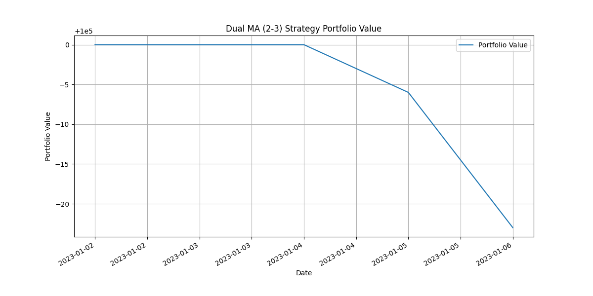
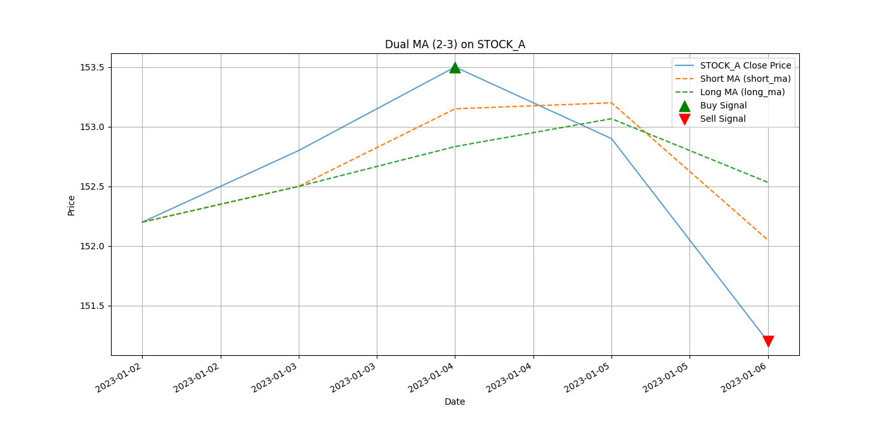
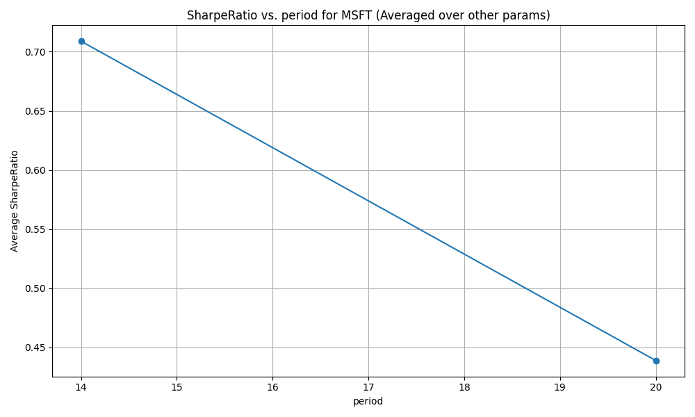
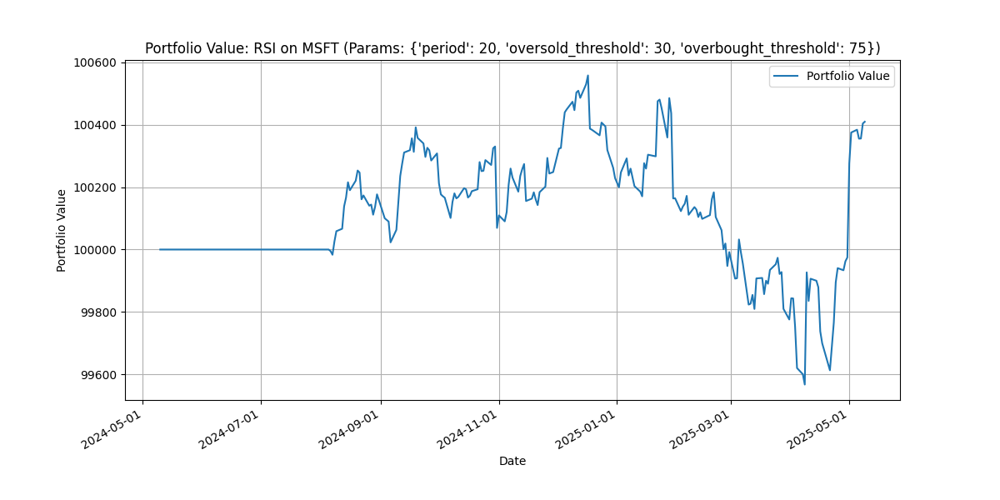

# 自定义量化交易程序

## 项目设置与运行 (Setup and Run)

为了运行本项目，建议遵循以下步骤设置环境并安装依赖：

### 1. 克隆仓库 (如果需要)
```bash
git clone https://github.com/keyboard3/trading.git
cd trading
```

### 2. 创建并激活虚拟环境 (推荐)
虚拟环境有助于隔离项目依赖，避免与系统全局Python环境或其他项目冲突。

使用 Python 3 自带的 `venv` 模块:
```bash
# 在项目根目录运行
python3 -m venv venv 
```
激活虚拟环境：
*   macOS / Linux:
    ```bash
    source venv/bin/activate
    ```
*   Windows (Git Bash 或其他类似shell):
    ```bash
    source venv/Scripts/activate 
    ```
*   Windows (Command Prompt):
    ```bash
    venv\Scripts\activate.bat
    ```
激活后，你的终端提示符前通常会显示 `(venv)`。

### 3. 安装依赖
项目所需的第三方库记录在 `requirements.txt` 文件中。在激活虚拟环境后，运行：
```bash
pip install -r requirements.txt
```
如果你没有使用虚拟环境，并且系统中使用 `pip3`，则运行 `pip3 install -r requirements.txt`。

**(推荐) 使用 Makefile 安装依赖:**
本项目提供了一个 `Makefile` 来简化常见操作。在激活虚拟环境后，您也可以使用以下命令安装依赖：
```bash
make install-deps
```

### 4. 运行程序与服务

本项目包含两种主要的运行模式：通过 `main.py` 直接执行批处理回测/参数优化，以及通过 FastAPI 后端 API 服务进行交互式回测。

**使用 Makefile (推荐):**

`Makefile` 提供了便捷的命令来启动服务和运行脚本。请确保您已按照上述步骤激活了虚拟环境。

*   **查看所有可用命令:**
    ```bash
    make help
    ```
*   **启动 FastAPI 后端 API 服务:**
    ```bash
    make run-api
    ```
    服务通常会运行在 `http://0.0.0.0:8000`。您可以通过浏览器访问 `http://localhost:8000/docs` 来查看和交互API文档。
*   **运行 `main.py` (批处理回测/参数优化):**
    ```bash
    make run-backtest-main
    ```
*   **获取最新市场数据:**
    ```bash
    make fetch-data
    ```
*   **从CSV初始化/加载数据到数据库:**
    ```bash
    make init-db-load-csv
    ```

**直接运行脚本 (传统方式):**

*   运行主程序 (`main.py`):
    ```bash
    python3 main.py 
    ```
    这将使用 `main.py` 中配置的参数执行回测或参数优化。
*   直接运行 FastAPI 服务 (不推荐用于日常开发，`make run-api`更好):
    ```bash
    # 确保在项目根目录执行
    uvicorn backend.main_api:app --reload --host 0.0.0.0 --port 8000
    ```

### 5. (可选) 退出虚拟环境
当你完成工作后，可以停用虚拟环境：
```bash
deactivate
```

---

本项目旨在创建一个个性化的量化交易程序，方便验证各种交易策略并评估其收益。项目将通过网页UI的形式呈现策略回测效果和相关数据分析。

## 项目开发阶段 (Phased Development Plan)

为了逐步熟悉量化交易领域并有序地构建系统，本项目将采用分阶段迭代的开发方式。

### 阶段一：核心回测引擎与手动数据处理

*   **总目标**: 构建一个基础的回测框架，能够针对手动导入的数据（如CSV文件）运行简单的交易策略，并输出基本的回测结果。
*   **总体状态**: `✅ 已完成`
*   **主要模块与任务**:
    *   `✅` **1. 项目初始化与基本结构搭建**:
        *   **目的**: 建立项目的基础目录结构，初始化版本控制。
        *   **选型/工具**: Git。
        *   **产出**: 定义如 `data/`, `strategies/`, `core_engine/`, `results/`, `main.py` (或类似入口脚本) 的目录。
    *   `✅` **2. 数据输入模块**:
        *   **目的**: 实现从CSV文件加载和解析历史市场数据（例如：日期, 开盘价, 最高价, 最低价, 收盘价, 成交量 - OHLCV）。
        *   **选型/工具**: Python, [Pandas库](docs/pandas_intro.md)。
        *   **产出**: 一个能够读取指定格式CSV数据并转换为Pandas DataFrame的函数或类。
    *   `✅` **3. 简单策略模块**:
        *   **目的**: 实现至少一个基础的交易策略逻辑，例如[双均线交叉策略](docs/dual_ma_crossover_strategy.md)。策略应能接收市场数据并产生买入/卖出/持有的信号。
        *   **选型/工具**: Python。
        *   **产出**: `strategies/simple_ma_strategy.py` 中的函数，能够根据输入数据生成交易信号。
    *   `✅` **4. 核心回测引擎**:
        *   **目的**: 根据策略产生的信号，逐根K线模拟交易过程。管理简单的投资组合（现金、持仓），计算每日盈亏和资产净值。
        *   **选型/工具**: Python。
        *   **产出**: `core_engine/backtest_engine.py` 中的回测主循环逻辑，能够处理交易信号、更新投资组合状态。
    *   `✅` **5. 结果输出与初步分析模块**:
        *   **目的**: 计算并展示基本的回测绩效指标（例如：总收益率、年化收益率、最大回撤、夏普比率（简化版））。输出交易明细列表。
        *   **选型/工具**: Python, Matplotlib (用于绘制简单的净值曲线图)。
        *   **产出**: `core_engine/performance_analyzer.py` 中的函数，用于输出回测报告（文本，包含[最大回撤](docs/max_drawdown_explained.md)、[夏普比率](docs/sharpe_ratio_explained.md)等指标）、绘制净值曲线图。
    *   `✅` **6. 整合与测试**:
        *   **目的**: 将上述模块整合起来，形成一个可运行的简单回测流程，并进行初步测试。
        *   **选型/工具**: Python。
        *   **产出**: `main.py` 脚本，可以从数据输入到结果输出完整运行。
*   **学习重点**: 回测基本流程、策略如何用代码表达、Pandas数据处理、关键绩效指标(KPIs)的含义与计算（如[最大回撤](docs/max_drawdown_explained.md)、[夏普比率](docs/sharpe_ratio_explained.md)）、Matplotlib基础绘图。
*   **成果示例**:
    运行 `python3 main.py` 后，程序将输出回测结果。核心成果包括：

    1.  **性能报告 (摘要)**:
        程序会生成一份详细的性能报告并打印到控制台，同时保存在 `results/phase1_performance_report.txt`。以下是报告中指标部分的示例内容：

        ```text
        --- 回测性能报告 ---
        总收益率 (%): 1.00 
        年化收益率 (%): N/A (期限小于一年或未知)
        最大回撤 (%): -0.49
        夏普比率 (年化): N/A
        总交易次数: 2
        买入次数: 1
        卖出次数: 1
        胜率 (%): N/A (需交易配对)
        平均盈利 ($): N/A (需交易配对)
        平均亏损 ($): N/A (需交易配对)
        ```
        *(注：以上数值为基于 `data/sample_stock_data.csv` 和默认参数 (短期MA=2, 长期MA=3) 在特定执行下的一个示例，实际数值会根据数据和参数变化。完整的报告（包含交易日志）请查看 `results/phase1_performance_report.txt` 文件。)*

    2.  **投资组合净值图**:
        展示了策略执行过程中投资组合总价值的变化情况。
        

    3.  **策略信号图 (针对 STOCK_A)**:
        在特定股票的价格图上标出买卖信号点，直观展示策略的决策过程。
        

### 阶段二：数据管理与策略库增强

*   **总目标**: 引入更规范的数据存储方案，丰富策略库，并开始考虑简单的策略参数优化。
*   **总体状态**: `[✅ 已完成]`
*   **主要模块与任务**:
    *   `✅` **1. 数据库集成与数据模型设计**:
        *   **目的**: 选择并集成一个数据库（如 SQLite）用于存储市场数据。设计初步的数据表结构（例如，用于存储OHLCV数据的表）。
        *   **选型/工具**: Python, SQLite。
        *   **产出**:
            *   项目中集成 SQLite 数据库。
            *   定义数据表结构的脚本或代码 (例如，在数据加载模块中体现)。
            *   更新/创建数据加载模块 (`core_engine/data_loader.py`)，使其能够从数据库读取数据，并支持将CSV数据导入数据库的功能（用于初期数据填充和兼容现有数据）。
    *   `✅` **2. 初步数据获取模块**:
        *   **目的**: 实现从一个外部数据源（如免费财经API）自动获取历史市场数据并存入我们建立的数据库。
        *   **选型/工具**: Python, `yfinance` 库 (Yahoo Finance)。
        *   **产出**:
            *   一个新的模块/脚本 (例如 `core_engine/data_fetcher.py`)，包含可以下载指定股票代码和时间段的OHLCV数据并存入SQLite数据库的函数。
            *   基本的用户提示、错误处理和日志记录。
    *   `✅` **3. 增强的策略库与参数化**:
        *   **目的**:
            *   将现有的双均线策略修改为可接受参数的形式（例如，均线窗口期可以作为函数参数传入）。
            *   至少添加一个新的、可参数化的交易策略，例如 [RSI策略](docs/rsi_strategy_explained.md) (Relative Strength Index)。
        *   **选型/工具**: Python。
        *   **产出**:
            *   修改 `strategies/simple_ma_strategy.py` 使其策略函数接受短期和长期均线窗口作为参数。
            *   创建新的策略文件 `strategies/rsi_strategy.py` 并实现可参数化的RSI策略逻辑。
            *   创建策略说明文档 `docs/rsi_strategy_explained.md`。
    *   `✅` **4. 回测引擎增强**:
        *   **目的**: 扩展核心回测引擎以支持更真实的模拟和分析：
            *   `✅` **交易成本**: 实现手续费的计算。当前采用模型：**费率 0.05% (万分之五)，每笔最低收费 5 元**。
            *   **(可选) [滑点模拟](docs/slippage_explained.md)**: 引入简单的滑点模型（如果时间和复杂度允许）。
            *   `✅` **参数遍历**: 支持对策略的一组参数进行遍历回测，以比较不同参数下的表现 (通过简单循环遍历预设参数组合)。
            *   `✅` **结果输出管理**: 每次运行的结果现在保存到 `results/[RUN_TAG]` 子文件夹中，由 `main.py` 中的 `CURRENT_RUN_TAG` 变量控制，便于管理和区分不同批次的实验结果。
        *   **选型/工具**: Python。
        *   **产出**:
            *   更新 `core_engine/backtest_engine.py` 以包含手续费计算逻辑，并在模拟交易时应用。
            *   (可选) 在 `core_engine/backtest_engine.py` 中加入滑点计算逻辑。
            *   在 `main.py` 或一个新的高层控制脚本中，实现对策略参数的循环遍历，并对每组参数运行回测。
            *   更新 `core_engine/performance_analyzer.py` 以在性能报告中体现交易成本，并调整指标计算以适应参数遍历后的批量结果。
            *   调整 `main.py` 使其将当次运行的报告、图表等输出到 `results` 下的一个特定子目录中，该子目录名由 `CURRENT_RUN_TAG` 变量定义。
    *   `✅` **5. 结果可视化增强 (初步)**:
        *   **目的**: 根据参数遍历的结果，提供更丰富的可视化，例如展示不同参数组合下的关键绩效指标对比（如参数影响图）。
        *   **选型/工具**: Python, Matplotlib/Pandas。
        *   **产出**:
            *   `✅` 更新 `core_engine/performance_analyzer.py` 中的绘图函数或添加新函数，以生成参数性能对比图表 (例如 `plot_parameter_impact`)。
            *   `✅` 修复了在参数优化绘图过程中可能出现的 'RuntimeWarning: More than 20 figures have been opened' 警告，增强了绘图稳定性。
            *   在 `main.py` (或控制脚本) 中调用新的可视化功能，将对比图表保存到 `results/[RUN_TAG]/` 目录。
*   **学习重点**: SQLite数据库操作 (创建表, 插入数据, 查询数据), 使用 `yfinance` 获取数据, 实现和参数化RSI等新策略, 理解交易成本和[滑点](docs/slippage_explained.md)对回测的影响, 参数优化（遍历）的基本概念及实现, Pandas和Matplotlib进阶用于结果汇总和对比展示。

*   **成果示例**:
    当配置 `main.py` 执行参数优化后 (例如 `PERFORM_OPTIMIZATION = True`)，程序运行后会在 `results/` 目录下创建一个由 `CURRENT_RUN_TAG` 指定的子文件夹 (例如 `results/RSI_MSFT_ParamOpt_SmallSet/`)，其中包含该次优化运行的所有产出。主要成果包括：

    1.  **参数优化概要 (控制台输出)**:
        程序会在控制台打印出基于主要评价指标（如夏普比率）排序的最佳参数组合：
        ```text
        ====== Top Performing Parameter Sets (by Sharpe Ratio) ======
        Top 2 results: (假设仅显示Top 2)
          股票代码   策略                                               参数  总回报率(%) 年化回报率(%)  夏普比率  最大回撤(%)  买入次数  卖出次数
        0   MSFT  RSI  {'period': 20, 'oversold_threshold': 30, 'o...       25.87       15.61  0.787808   -12.893035         7         7
        1   MSFT  RSI  {'period': 14, 'oversold_threshold': 25, 'o...       18.33       10.77  0.585137   -10.228701        10        10
        ```
        *(注：以上数值及参数为示例，实际结果会随数据和参数配置而变化。)*

    2.  **参数优化详细汇总 (CSV文件)**:
        所有参数组合的回测性能指标会保存在一个CSV文件中，路径类似于 `results/RSI_MSFT_ParamOpt_SmallSet/all_backtests_summary_RSI_OPTIMIZED.csv`。其内容结构大致如下：
        ```csv
        股票代码,策略,参数,总回报率(%),年化回报率(%),夏普比率,最大回撤(%),买入次数,卖出次数
        MSFT,RSI,"{'period': 20, 'oversold_threshold': 30, 'overbought_threshold': 75}",25.87,15.61,0.787808,-12.893035,7,7
        MSFT,RSI,"{'period': 14, 'oversold_threshold': 25, 'overbought_threshold': 70}",18.33,10.77,0.585137,-10.228701,10,10
        MSFT,RSI,"{'period': 14, 'oversold_threshold': 30, 'overbought_threshold': 75}",-5.20,-3.15,-0.174022,-15.730011,8,8
        ...
        ```

    3.  **单次回测报告 (含交易成本)**:
        对于参数优化过程中的每一次独立回测，都会生成详细的文本报告，例如 `results/RSI_MSFT_ParamOpt_SmallSet/report_RSI_MSFT_period20_oversold_threshold30_overbought_threshold75.txt`。报告中包含了手续费信息和带手续费的交易记录：
        ```text
        --- RSI 策略在 MSFT上的回测报告
        参数: {'period': 20, 'oversold_threshold': 30, 'overbought_threshold': 75}
        初始资金: 100000.0 ---
        手续费设置: 费率=0.0500%, 最低收费=5.00元/笔
        ---
        总收益率 (%): 25.87
        年化收益率 (%): 15.61
        最大回撤 (%): -12.89
        夏普比率 (年化): 0.79
        总交易次数: 14
        买入次数: 7
        卖出次数: 7
        ...

        --- 交易记录 ---
           symbol action  quantity   price      cost  commission  holding_quantity cash_after_trade  position_value  total_value
        timestamp
        2023-02-15   MSFT    BUY       200  260.11  52022.00        26.01               200         47951.99        52022.00    100000.00
        2023-03-10   MSFT   SELL       200  270.50 -54100.00        27.05                 0        102024.94            0.00    102024.94
        ...
        ```

    4.  **参数影响可视化**: 
        程序会为每个优化的参数生成其对关键指标影响的图表，例如 `results/RSI_MSFT_ParamOpt_SmallSet/param_impact_SharpeRatio_vs_period_for_MSFT_all_others_averaged.png`。
        
        *(此图展示了当RSI策略的`period`参数变化时，在MSFT股票上，平均夏普比率如何随之变化，其他参数取平均效果。)*

    5.  **投资组合价值图 (示例)**:
        每次独立回测也会生成投资组合价值图，例如 `results/RSI_MSFT_ParamOpt_SmallSet/portfolio_RSI_MSFT_period20_oversold_threshold30_overbought_threshold75.png`。
        

### 阶段三：Web UI 展示与交互

*   **目标**: 构建一个简单的 Web 界面，用于展示回测结果，并允许用户通过界面选择策略、设置参数、启动回测。
*   **总体状态**: `[进行中 - 后端API基础已搭建，前端待开发]`
*   **主要模块与任务**:
    *   `✅` **后端 API 服务 (FastAPI)**:
        *   `✅` **应用基础**: 搭建 FastAPI 应用，处理请求和响应。
        *   `✅` **数据库初始化**: API启动时自动调用 `init_db()` 确保数据库就绪。
        *   `✅` **策略查询接口**: 实现 `GET /api/v1/strategies` 端点，返回所有可用策略及其默认配置和参数网格信息 (从 `main.py` 的 `STRATEGY_CONFIG` 读取)。
        *   `✅` **回测执行接口**: 实现 `POST /api/v1/backtest/run` 端点，用于接收回测请求:
            *   `✅` **核心逻辑集成**: 调用从 `main.py` 重构出的 `execute_single_backtest_run` 函数，执行完整的单次回测流程（数据加载、信号生成、回测引擎、性能分析、报告和图表生成）。
            *   `✅` **多股票支持**: 支持对请求中指定的单个或多个股票代码进行回测。
            *   `✅` **动态结果目录**: 为每次API调用，在服务器端的 `results/api_runs/` 目录下创建一个基于策略、首个股票代码、时间戳和UUID的唯一子目录，用于存放该次运行生成的报告和图表文件。
            *   `✅` **JSON响应**: 返回包含详细回测结果的JSON响应。对每个成功回测的股票，包含性能指标字典 (`metrics`)、以及指向生成的文本报告和图表的Web可访问URL路径 (例如 `/api_runs/<run_id>/report_RSI_MSFT_....txt`)。
        *   `✅` **静态文件服务**: 配置FastAPI以提供对 `results/api_runs/` 目录下结果文件的静态访问，使得API返回的URL可以直接在浏览器中打开。
    *   `✅` **Makefile 集成**:
        *   `✅` 创建 `Makefile`，包含常用命令如 `make run-api`, `make run-backtest-main`, `make install-deps`, `make fetch-data` 等。
        *   `✅` `Makefile` 中的命令配置为直接使用 `venv` 虚拟环境中的Python解释器和相关可执行文件，提高了便捷性和环境一致性。
    *   `⏳` **前端 Web UI (React + Tailwind CSS)**:
        *   **构思与设计**: 初步构思UI布局（导航、回测设置区、结果展示区）。
        *   **(待办)** 组件开发：开发用于策略选择、参数输入、日期选择、股票代码输入的前端组件。
        *   **(待办)** API交互：实现前端与后端API的通信，发送回测请求，接收并展示结果。
        *   **(待办)** 结果可视化：在前端展示性能指标、渲染图表（可能直接使用图片URL，或考虑图表库）。
*   **学习重点**: Web后端开发 (FastAPI), API设计与实现, 异步编程, Pydantic数据校验, 前端框架基础 (React), CSS框架 (Tailwind CSS), 前后端数据交互。

### 阶段四：高级功能与优化 (可选)

*   **目标**: 引入更高级的策略、风险管理、实时数据处理和可能的模拟/实盘交易接口。
*   **主要模块**:
    *   实时数据流处理
    *   高级策略 (机器学习等)
    *   投资组合管理
    *   风险管理
    *   交易接口对接
    *   日志与监控
*   **学习重点**: 流式处理, 高级模型, 交易API, 系统监控。

---

详细的架构决策、技术选型和设计规范将在 `ARCHITECTURE.md` 文件中逐步记录和完善。
