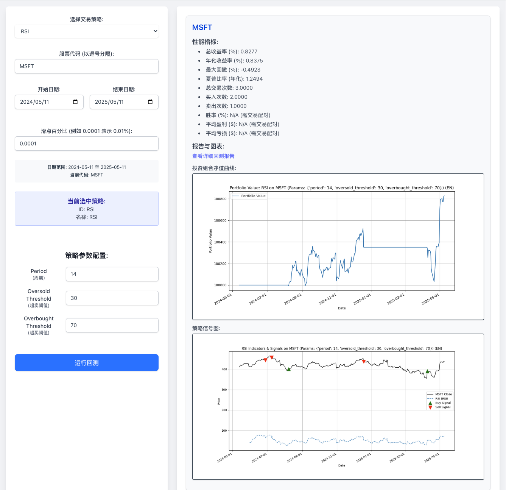

# 自定义量化交易程序

## 项目设置与运行 (Setup and Run)

### 0. 先决条件 (Prerequisites)
在开始之前，请确保您的系统已安装以下软件：
*   **Python**: 版本 3.10 或更高。
*   **Node.js**: 版本 18.x 或 LTS 版本。
*   **npm**: 通常随 Node.js 一同安装。npm 用于管理前端项目的依赖。

为了运行本项目，建议遵循以下步骤设置环境并安装依赖：

### 1. 克隆仓库 (如果需要)
```bash
git clone https://github.com/keyboard3/trading.git
cd trading
```

### 2. 创建并激活虚拟环境 (推荐)
虚拟环境有助于隔离项目依赖，避免与系统全局Python环境或其他项目冲突。

使用 Python 3 自带的 `venv` 模块:
```bash
# 在项目根目录运行
python3 -m venv venv 
```
激活虚拟环境：
*   macOS / Linux:
    ```bash
    source venv/bin/activate
    ```
*   Windows (Git Bash 或其他类似shell):
    ```bash
    source venv/Scripts/activate 
    ```
*   Windows (Command Prompt):
    ```bash
    venv\Scripts\activate.bat
    ```
激活后，你的终端提示符前通常会显示 `(venv)`。

### 3. 安装依赖
**推荐使用 Makefile 安装后端依赖:**
本项目提供了一个 `Makefile` 来简化常见操作。在激活虚拟环境后，请使用以下命令安装所有后端 Python 依赖：
```bash
make install-deps
```

**或者，手动安装后端依赖 (Alternative, manual installation):**
如果希望手动安装，项目所需的后端 Python 库记录在 `requirements.txt` 文件中。在激活虚拟环境后，运行：
```bash
pip install -r requirements.txt
```

### 4. 运行程序与服务

本项目包含两种主要的运行模式：通过 `main.py` 直接执行批处理回测/参数优化，以及通过 FastAPI 后端 API 服务进行交互式回测。

**使用 Makefile (推荐):**

`Makefile` 提供了便捷的命令来启动服务和运行脚本。请确保您已按照上述步骤激活了虚拟环境。

*   **查看所有可用命令:**
    ```bash
    make help
    ```
*   **启动 FastAPI 后端 API 服务:**
    ```bash
    make run-api
    ```
    服务通常会运行在 `http://0.0.0.0:8000`。您可以通过浏览器访问 `http://localhost:8000/docs` 来查看和交互API文档。
*   **启动前端开发服务器:**
    前端 React 应用位于 `frontend/` 目录。
    ```bash
    # 确保您在项目根目录
    cd frontend
    npm install  # 首次运行或依赖更新后执行
    npm run dev
    cd .. # 返回项目根目录 (可选，根据您的操作习惯)
    ```
    Vite 开发服务器通常会运行在 `http://localhost:5173` (或自动选择的下一个可用端口) 并可能自动在浏览器中打开页面。
    **重要提示:** 请确保在启动前端服务前，后端API服务 (例如通过 `make run-api`) 已经成功运行，否则前端将无法获取数据或执行回测。
*   **运行 `main.py` (批处理回测/参数优化):**
    ```bash
    make run-backtest-main
    ```
*   **获取最新市场数据:**
    ```bash
    make fetch-data
    ```
*   **从CSV初始化/加载数据到数据库:**
    ```bash
    make init-db-load-csv
    ```

**直接运行脚本 (传统方式):**

*   运行主程序 (`main.py`):
    ```bash
    python3 main.py 
    ```
    这将使用 `main.py` 中配置的参数执行回测或参数优化。
*   直接运行 FastAPI 服务 (不推荐用于日常开发，`make run-api`更好):
    ```bash
    # 确保在项目根目录执行
    uvicorn backend.main_api:app --reload --host 0.0.0.0 --port 8000
    ```

### 5. (可选) 退出虚拟环境
当你完成工作后，可以停用虚拟环境：
```bash
deactivate
```

---

本项目旨在创建一个个性化的量化交易程序，方便验证各种交易策略并评估其收益。项目将通过网页UI的形式呈现策略回测效果和相关数据分析。

## 项目开发阶段 (Phased Development Plan)

为了逐步熟悉量化交易领域并有序地构建系统，本项目将采用分阶段迭代的开发方式。

### 阶段一：核心回测引擎与手动数据处理

*   **总目标**: 构建一个基础的回测框架，能够针对手动导入的数据（如CSV文件）运行简单的交易策略，并输出基本的回测结果。
*   **总体状态**: `✅ 已完成`
*   **主要模块与任务**:
    *   `✅` **1. 项目初始化与基本结构搭建**:
        *   **目的**: 建立项目的基础目录结构，初始化版本控制。
        *   **选型/工具**: Git。
        *   **产出**: 定义如 `data/`, `strategies/`, `core_engine/`, `results/`, `main.py` (或类似入口脚本) 的目录。
    *   `✅` **2. 数据输入模块**:
        *   **目的**: 实现从CSV文件加载和解析历史市场数据（例如：日期, 开盘价, 最高价, 最低价, 收盘价, 成交量 - OHLCV）。
        *   **选型/工具**: Python, [Pandas库](docs/pandas_intro.md)。
        *   **产出**: 一个能够读取指定格式CSV数据并转换为Pandas DataFrame的函数或类。
    *   `✅` **3. 简单策略模块**:
        *   **目的**: 实现至少一个基础的交易策略逻辑，例如[双均线交叉策略](docs/dual_ma_crossover_strategy.md)。策略应能接收市场数据并产生买入/卖出/持有的信号。
        *   **选型/工具**: Python。
        *   **产出**: `strategies/simple_ma_strategy.py` 中的函数，能够根据输入数据生成交易信号。
    *   `✅` **4. 核心回测引擎**:
        *   **目的**: 根据策略产生的信号，逐根K线模拟交易过程。管理简单的投资组合（现金、持仓），计算每日盈亏和资产净值。
        *   **选型/工具**: Python。
        *   **产出**: `core_engine/backtest_engine.py` 中的回测主循环逻辑，能够处理交易信号、更新投资组合状态。
    *   `✅` **5. 结果输出与初步分析模块**:
        *   **目的**: 计算并展示基本的回测绩效指标（例如：总收益率、年化收益率、最大回撤、夏普比率（简化版））。输出交易明细列表。
        *   **选型/工具**: Python, Matplotlib (用于绘制简单的净值曲线图)。
        *   **产出**: `core_engine/performance_analyzer.py` 中的函数，用于输出回测报告（文本，包含[最大回撤](docs/max_drawdown_explained.md)、[夏普比率](docs/sharpe_ratio_explained.md)等指标）、绘制净值曲线图。
    *   `✅` **6. 整合与测试**:
        *   **目的**: 将上述模块整合起来，形成一个可运行的简单回测流程，并进行初步测试。
        *   **选型/工具**: Python。
        *   **产出**: `main.py` 脚本，可以从数据输入到结果输出完整运行。
*   **学习重点**: 回测基本流程、策略如何用代码表达、Pandas数据处理、关键绩效指标(KPIs)的含义与计算（如[最大回撤](docs/max_drawdown_explained.md)、[夏普比率](docs/sharpe_ratio_explained.md)）、Matplotlib基础绘图。
*   **成果示例**:
    运行 `python3 main.py` 后，程序将输出回测结果。核心成果包括：

    1.  **性能报告 (摘要)**:
        程序会生成一份详细的性能报告并打印到控制台，同时保存在 `docs/log/phase1_performance_report.txt`。以下是报告中指标部分的示例内容：

        ```text
        --- 回测性能报告 ---
        总收益率 (%): 1.00 
        年化收益率 (%): N/A (期限小于一年或未知)
        最大回撤 (%): -0.49
        夏普比率 (年化): N/A
        总交易次数: 2
        买入次数: 1
        卖出次数: 1
        胜率 (%): N/A (需交易配对)
        平均盈利 ($): N/A (需交易配对)
        平均亏损 ($): N/A (需交易配对)
        ```
        *(注：以上数值为基于 `data/sample_stock_data.csv` 和默认参数 (短期MA=2, 长期MA=3) 在特定执行下的一个示例，实际数值会根据数据和参数变化。完整的报告（包含交易日志）请查看 `docs/log/phase1_performance_report.txt` 文件。)*

    2.  **投资组合净值图**:
        展示了策略执行过程中投资组合总价值的变化情况。
        

    3.  **策略信号图 (针对 STOCK_A)**:
        在特定股票的价格图上标出买卖信号点，直观展示策略的决策过程。
        

### 阶段二：数据管理与策略库增强

*   **总目标**: 引入更规范的数据存储方案，丰富策略库，并开始考虑简单的策略参数优化。
*   **总体状态**: `[✅ 已完成]`
*   **主要模块与任务**:
    *   `✅` **1. 数据库集成与数据模型设计**:
        *   **目的**: 选择并集成一个数据库（如 SQLite）用于存储市场数据。设计初步的数据表结构（例如，用于存储OHLCV数据的表）。
        *   **选型/工具**: Python, SQLite。
        *   **产出**:
            *   项目中集成 SQLite 数据库。
            *   定义数据表结构的脚本或代码 (例如，在数据加载模块中体现)。
            *   更新/创建数据加载模块 (`core_engine/data_loader.py`)，使其能够从数据库读取数据，并支持将CSV数据导入数据库的功能（用于初期数据填充和兼容现有数据）。
    *   `✅` **2. 初步数据获取模块**:
        *   **目的**: 实现从一个外部数据源（如免费财经API）自动获取历史市场数据并存入我们建立的数据库。
        *   **选型/工具**: Python, `yfinance` 库 (Yahoo Finance)。
        *   **产出**:
            *   一个新的模块/脚本 (例如 `core_engine/data_fetcher.py`)，包含可以下载指定股票代码和时间段的OHLCV数据并存入SQLite数据库的函数。
            *   基本的用户提示、错误处理和日志记录。
    *   `✅` **3. 增强的策略库与参数化**:
        *   **目的**:
            *   将现有的双均线策略修改为可接受参数的形式（例如，均线窗口期可以作为函数参数传入）。
            *   至少添加一个新的、可参数化的交易策略，例如 [RSI策略](docs/rsi_strategy_explained.md) (Relative Strength Index)。
        *   **选型/工具**: Python。
        *   **产出**:
            *   修改 `strategies/simple_ma_strategy.py` 使其策略函数接受短期和长期均线窗口作为参数。
            *   创建新的策略文件 `strategies/rsi_strategy.py` 并实现可参数化的RSI策略逻辑。
            *   创建策略说明文档 `docs/rsi_strategy_explained.md`。
    *   `✅` **4. 回测引擎增强**:
        *   **目的**: 扩展核心回测引擎以支持更真实的模拟和分析：
            *   `✅` **交易成本**: 实现手续费的计算。当前采用模型：**费率 0.05% (万分之五)，每笔最低收费 5 元**。
            *   `✅` **[滑点模拟](docs/slippage_explained.md)**: 已实现基于百分比的滑点模型。用户可在UI上配置滑点值（例如0.01%），或使用后端默认值。滑点会影响实际成交价并记录在性能报告中。
            *   `✅` **参数遍历**: 支持对策略的一组参数进行遍历回测，以比较不同参数下的表现 (通过简单循环遍历预设参数组合)。
            *   `✅` **结果输出管理**: 每次运行的结果现在保存到 `results/[RUN_TAG]` 子文件夹中，由 `main.py` 中的 `CURRENT_RUN_TAG` 变量控制，便于管理和区分不同批次的实验结果。
        *   **选型/工具**: Python。
        *   **产出**:
            *   更新 `core_engine/backtest_engine.py` 以包含手续费计算逻辑，并在模拟交易时应用。
            *   (可选) 在 `core_engine/backtest_engine.py` 中加入滑点计算逻辑。
            *   在 `main.py` 或一个新的高层控制脚本中，实现对策略参数的循环遍历，并对每组参数运行回测。
            *   更新 `core_engine/performance_analyzer.py` 以在性能报告中体现交易成本，并调整指标计算以适应参数遍历后的批量结果。
            *   调整 `main.py` 使其将当次运行的报告、图表等输出到 `results` 下的一个特定子目录中，该子目录名由 `CURRENT_RUN_TAG` 变量定义。
    *   `✅` **5. 结果可视化增强 (初步)**:
        *   **目的**: 根据参数遍历的结果，提供更丰富的可视化，例如展示不同参数组合下的关键绩效指标对比（如参数影响图）。
        *   **选型/工具**: Python, Matplotlib/Pandas。
        *   **产出**:
            *   `✅` 更新 `core_engine/performance_analyzer.py` 中的绘图函数或添加新函数，以生成参数性能对比图表 (例如 `plot_parameter_impact`)。
            *   `✅` 修复了在参数优化绘图过程中可能出现的 'RuntimeWarning: More than 20 figures have been opened' 警告，增强了绘图稳定性。
            *   在 `main.py` (或控制脚本) 中调用新的可视化功能，将对比图表保存到 `results/[RUN_TAG]/` 目录。
*   **学习重点**: SQLite数据库操作 (创建表, 插入数据, 查询数据), 使用 `yfinance` 获取数据, 实现和参数化RSI等新策略, 理解交易成本和[滑点](docs/slippage_explained.md)对回测的影响, 参数优化（遍历）的基本概念及实现, Pandas和Matplotlib进阶用于结果汇总和对比展示。

*   **成果示例**:
    当配置 `main.py` 执行参数优化后 (例如 `PERFORM_OPTIMIZATION = True`)，程序运行后会在临时结果目录下创建一个由 `CURRENT_RUN_TAG` 指定的子文件夹 (例如 `RSI_MSFT_ParamOpt_SmallSet/`)，其中包含该次优化运行的所有产出。主要的存档成果示例包括：

    1.  **参数优化概要 (控制台输出)**:
        程序会在控制台打印出基于主要评价指标（如夏普比率）排序的最佳参数组合：
        ```text
        ====== Top Performing Parameter Sets (by Sharpe Ratio) ======
        Top 2 results: (假设仅显示Top 2)
          股票代码   策略                                               参数  总回报率(%) 年化回报率(%)  夏普比率  最大回撤(%)  买入次数  卖出次数
        0   MSFT  RSI  {'period': 20, 'oversold_threshold': 30, 'o...       25.87       15.61  0.787808   -12.893035         7         7
        1   MSFT  RSI  {'period': 14, 'oversold_threshold': 25, 'o...       18.33       10.77  0.585137   -10.228701        10        10
        ```
        *(注：以上数值及参数为示例，实际结果会随数据和参数配置而变化。)*

    2.  **参数优化详细汇总 (CSV文件)**:
        所有参数组合的回测性能指标会保存在一个CSV文件中，示例路径为 `docs/log/all_backtests_summary_RSI_OPTIMIZED.csv`。其内容结构大致如下：
        ```csv
        股票代码,策略,参数,总回报率(%),年化回报率(%),夏普比率,最大回撤(%),买入次数,卖出次数
        MSFT,RSI,"{'period': 20, 'oversold_threshold': 30, 'overbought_threshold': 75}",25.87,15.61,0.787808,-12.893035,7,7
        MSFT,RSI,"{'period': 14, 'oversold_threshold': 25, 'overbought_threshold': 70}",18.33,10.77,0.585137,-10.228701,10,10
        MSFT,RSI,"{'period': 14, 'oversold_threshold': 30, 'overbought_threshold': 75}",-5.20,-3.15,-0.174022,-15.730011,8,8
        ...
        ```

    3.  **单次回测报告 (含交易成本)**:
        对于参数优化过程中的每一次独立回测，都会生成详细的文本报告，例如 `docs/log/report_RSI_MSFT_period20_oversold_threshold30_overbought_threshold75.txt`。报告中包含了手续费信息和带手续费的交易记录：
        ```text
        --- RSI 策略在 MSFT上的回测报告
        参数: {'period': 20, 'oversold_threshold': 30, 'overbought_threshold': 75}
        初始资金: 100000.0 ---
        手续费设置: 费率=0.0500%, 最低收费=5.00元/笔
        ---
        总收益率 (%): 25.87
        年化收益率 (%): 15.61
        最大回撤 (%): -12.89
        夏普比率 (年化): 0.79
        总交易次数: 14
        买入次数: 7
        卖出次数: 7
        ...

        --- 交易记录 ---
           symbol action  quantity   price      cost  commission  holding_quantity cash_after_trade  position_value  total_value
        timestamp
        2023-02-15   MSFT    BUY       200  260.11  52022.00        26.01               200         47951.99        52022.00    100000.00
        2023-03-10   MSFT   SELL       200  270.50 -54100.00        27.05                 0        102024.94            0.00    102024.94
        ...
        ```

    4.  **参数影响可视化**: 
        程序会为每个优化的参数生成其对关键指标影响的图表，例如 `docs/images/param_impact_SharpeRatio_vs_period_for_MSFT_all_others_averaged.png`。
        
        *(此图展示了当RSI策略的`period`参数变化时，在MSFT股票上，平均夏普比率如何随之变化，其他参数取平均效果。)*

    5.  **投资组合价值图 (示例)**:
        每次独立回测也会生成投资组合价值图，例如 `docs/images/portfolio_RSI_MSFT_period20_oversold_threshold30_overbought_threshold75.png`。
        

### 阶段三：Web UI 展示与交互

*   **目标**: 构建一个交互友好、信息展示清晰的 Web 界面，用于选择策略、配置参数、运行回测，并直观地展示回测结果，特别针对桌面端优化布局。
*   **总体状态**: `[✅ 核心功能已完成并优化 - PC端双栏布局，图表内嵌]`
*   **主要模块与任务**:
    *   `✅` **后端 API 服务 (FastAPI)**:
        *   `✅` **应用基础**: 搭建 FastAPI 应用，处理请求和响应。
        *   `✅` **数据库初始化**: API启动时自动调用 `init_db()` 确保数据库就绪。
        *   `✅` **策略查询接口**: 实现 `GET /api/v1/strategies` 端点，返回所有可用策略及其默认配置和参数网格信息 (从 `main.py` 的 `STRATEGY_CONFIG` 读取)。
        *   `✅` **回测执行接口**: 实现 `POST /api/v1/backtest/run` 端点，用于接收回测请求:
            *   `✅` **核心逻辑集成**: 调用从 `main.py` 重构出的 `execute_single_backtest_run` 函数，执行完整的单次回测流程（数据加载、信号生成、回测引擎、性能分析、报告和图表生成）。
            *   `✅` **多股票支持**: 支持对请求中指定的单个或多个股票代码进行回测。
            *   `✅` **动态结果目录**: 为每次API调用，在服务器端的 `results/api_runs/` 目录下创建一个基于策略、首个股票代码、时间戳和UUID的唯一子目录，用于存放该次运行生成的报告和图表文件。
            *   `✅` **JSON响应**: 返回包含详细回测结果的JSON响应。对每个成功回测的股票，包含性能指标字典 (`metrics`)、以及指向生成的文本报告和图表的Web可访问URL路径 (例如 `/api_runs/<run_id>/report_RSI_MSFT_....txt`)。字段名已优化以匹配前端需求 (如 `ticker`)。
        *   `✅` **静态文件服务**: 配置FastAPI以提供对 `results/api_runs/` 目录下结果文件的静态访问，使得API返回的URL可以直接在浏览器中打开。
        *   `✅` `Makefile` 中的命令配置为直接使用 `venv` 虚拟环境中的Python解释器和相关可执行文件，提高了便捷性和环境一致性。
    *   `✅` **前端 Web UI (React + Tailwind CSS)**:
        *   `✅` **PC端优化布局**: 实现响应式的左右双栏布局。
            *   **左侧参数配置区**: 包含策略选择器、股票代码输入、日期范围选择器，以及动态生成的策略参数输入表单（支持多列显示和中英文标签）。
            *   **右侧结果展示区**: 清晰展示回测状态、运行ID、各股票的性能指标。
        *   `✅` **组件开发**: 开发并完善了用于策略选择、参数输入（`ParametersForm`已优化为多列布局并支持中英文标签）、日期选择、股票代码输入、运行按钮、整体布局（`Layout.tsx`，`App.tsx`实现双栏结构）及结果展示的前端组件。
        *   `✅` **API交互**: 实现前端与后端API的通信，发送回测请求，接收并展示结果。
        *   `✅` **内嵌图表**: 在结果展示区直接内嵌"投资组合净值曲线图"和"策略信号图"，提供更直观的视觉反馈。详细文本报告仍可通过链接访问。
*   **学习重点**: Web后端开发 (FastAPI), API设计与实现, 异步编程, Pydantic数据校验, 前端框架基础 (React), CSS框架 (Tailwind CSS), 前后端数据交互, 响应式UI设计。
*   **成果示例**:
    Web界面现在提供了一个更适合桌面使用的布局：左侧为参数配置区域，右侧实时展示回测结果。

    1.  **PC端双栏布局示意图**:
        

    关键特性包括：
    *   清晰的参数配置界面，支持中英文标签，并根据屏幕宽度动态调整参数表单列数。
    *   即时的回测结果反馈，包含详细的性能指标。
    *   投资组合净值曲线和策略信号图直接嵌入显示，方便快速分析。

### 阶段四：实时数据处理与模拟交易系统

*   **总目标**: 构建一个能够接入模拟实时数据流的交易系统，允许用户通过Web UI选择并运行不同的交易策略，动态观察模拟交易过程，并为未来的实盘交易做准备。
*   **总体状态**: `[阶段性完成]`
*   **主要模块与任务**:
    *   `✅` **1. 模拟实时数据提供者 (`MockRealtimeDataProvider`)**:
        *   **目的**: 实现一个可配置的模拟数据源，能够以指定的时间间隔和波动率为多个虚拟股票代码生成价格 Ticks。
        *   **产出**: `core_engine/realtime_feed.py` 中的 `MockRealtimeDataProvider` 类，能够生成 `DataTick` 对象 (namedtuple)。
    *   `✅` **2. 实时策略基类与适配 (`RealtimeDataProviderBase`, `RealtimeSimpleMAStrategy`, `RealtimeRSIStrategy`)**:
        *   **目的**: 定义实时数据提供者的抽象接口，并将现有的回测策略（如MA、RSI）适配为可以接收实时Tick数据并产生信号的实时版本。
        *   **产出**: `core_engine/realtime_feed_base.py` (抽象基类), `strategies/simple_ma_strategy.py` 中的 `RealtimeSimpleMAStrategy`，以及 `strategies/realtime_rsi_strategy.py` 中的 `RealtimeRSIStrategy`。核心计算逻辑（如RSI计算）被重构以便于回测和实时模式共享。
    *   `✅` **3. 模拟投资组合与交易引擎 (`MockPortfolio`, `MockTradingEngine`)**:
        *   **目的**: 实现能够根据实时策略信号执行模拟交易、管理持仓和现金、记录交易日志的组件。
        *   **产出**: `core_engine/portfolio.py` 中的 `MockPortfolio` 和 `core_engine/trading_engine.py` 中的 `MockTradingEngine`。
    *   `✅` **4. 后端API支持实时模拟**: 
        *   **目的**: 在FastAPI后端添加用于管理和查询实时模拟状态的API端点。
        *   **产出**: `backend/main_api.py` 中新增：
            *   策略注册表 (`STRATEGY_REGISTRY`)，用于动态加载和配置实时策略 (已支持MA和RSI)。
            *   API端点如 `GET /api/simulation/available_strategies`, `POST /api/simulation/start`, `POST /api/simulation/stop`, `GET /api/simulation/status`。
            *   管理全局模拟会话的逻辑，包括组件的动态实例化、启停和状态持久化（例如，停止模拟后保留投资组合状态以便查看，启动新模拟或关闭应用时则完全清除）。
    *   `✅` **5. 前端UI支持实时模拟**: 
        *   **目的**: 在React前端实现用于控制和展示实时模拟交易的用户界面。
        *   **产出**:
            *   `frontend/src/components/StrategyControlPanel.tsx`: 允许用户从后端获取的策略列表中选择策略（MA、RSI）、动态配置其参数（包括以"万元"为单位的初始资金）、启动/停止模拟。
            *   `frontend/src/components/SimulationDisplay.tsx` (及其子组件: `PortfolioSummary`, `HoldingsTable`, `TradesList`, `StrategyInfoDisplay`): 动态展示模拟的投资组合摘要、详细持仓、最近交易记录和当前运行的策略信息。模拟停止后仍显示最后状态。
            *   `frontend/src/App.tsx`: 实现"历史回测结果"和"实时模拟交易"的Tab切换，优化了组件渲染逻辑。
            *   对各类UI提示、加载状态、禁用控件样式等进行了优化，提升用户体验。
    *   `[ ]` **6. (后续) 模拟交易功能增强与细节完善**: 
        *   例如：UI支持清除/重置投资组合状态、更详细的错误反馈和日志展示到前端、多种模拟数据生成模式、更复杂的订单类型模拟等。
*   **学习重点**: 实时系统设计、线程与并发基础（数据提供者）、回调机制、状态管理（前端与后端）、WebSocket或轮询API设计、Pydantic模型在FastAPI中的应用、React组件化与状态钩子 (useState, useEffect, useCallback)、TypeScript接口定义。
*   **成果示例**:
    用户现在可以通过Web界面的"实时模拟交易"标签页，从下拉菜单中选择"实时简单移动平均线策略"或"实时RSI震荡策略"，配置其参数如股票代码、均线窗口或RSI周期、超买超卖阈值等，设定初始资金（以万元为单位）后启动模拟。启动后，界面会动态更新当前的投资组合价值、现金、详细持仓、最近发生的模拟交易记录以及当前运行的策略详情。当模拟停止后，这些最终状态信息会被保留在界面上供用户查看。

    下图展示了正在运行"实时RSI震荡策略"时的用户界面：

     
    *(注: 上图展示了选择RSI策略，并针对MSFT股票进行模拟交易的场景。左侧为策略选择和控制面板，右侧实时显示投资组合、持仓、交易日志和当前策略参数等动态信息。)*

### Phase 5: 投资组合与风险管理

*   **总目标**: 深入实践投资组合管理的核心理念与基础的风险控制策略，增强模拟交易的金融专业性和决策支持能力。本阶段旨在将关键的金融概念转化为可操作的系统功能，并提供直观的界面反馈。
*   **总体状态**: `[🚧 进行中 - 核心风险管理功能已实现]`
*   **主要模块与金融能力建设**:
    *   **1. 精细化投资组合表现度量与洞察**:
        *   `✅` **理解盈亏构成**: 系统能够精确区分并跟踪**已实现盈亏**（平仓后锁定利润或损失）与**未实现盈亏**（持仓期间市值波动产生的浮动盈亏）。这对于准确评估策略在不同市场阶段的盈利能力、识别利润来源以及理解当前风险暴露至关重要。
        *   `✅` **审视资产配置结构**: 实现对投资组合中各资产（如不同股票）市值的动态计算，并展示其占总资产净值的百分比。这有助于直观评估资产配置的**集中度风险**，判断是否存在对单一资产的过度依赖，是分散化投资管理的基础。
        *   `✅` **历史表现基准**: 跟踪记录投资组合的历史峰值净值，为后续进行更准确的**最大回撤评估**（衡量策略可能遭遇的最大资金缩水幅度）提供关键数据基础。
    *   **2. 构建基础的金融风险管理框架**:
        *   `✅` **参数化的风险容忍度设定**: 允许用户（通过API或预设参数）定义关键的风险阈值，例如单笔交易或单个持仓允许的最大亏损比例（**个股止损**）、单个资产在投资组合中的最大市值占比（**仓位规模控制**）、以及整个账户能承受的最大资金回撤比例（**账户最大回撤**）。这体现了风险管理中"事前规划，量化风险"的核心思想。
        *   `✅` **多层级的风险监控与预警**:
            *   在模拟交易过程中，系统会基于上述用户定义的风险参数，在多个关键节点（如交易执行前、市场价格更新后）自动进行风险评估。
            *   **预交易检查**: 例如，在尝试开新仓位前，检查是否会突破单资产的最大持仓限制，避免过度集中投资。
            *   **持续性监控**: 对已持有的仓位，实时监控其亏损是否触及止损线；对整个账户，持续监控其净值是否从历史高点回撤过多。
            *   当任何预设的风险阈值被触发时，系统会生成明确的**风险告警**信息。这些告警旨在及时提醒模拟交易者潜在的风险事件，辅助其做出更审慎的决策，或在真实交易场景中作为干预和调整的依据。
        *   `✅` **直观的风险状态反馈**: 通过用户界面将产生的风险告警清晰地展示给用户，确保风险信息传递的有效性。
    *   **进行中/未来探索的金融能力**:
        *   `🔄` **更高级的风险量化模型**: 例如探索引入Value at Risk (VaR) 或 Conditional Value at Risk (CVaR) 等业界常用的风险度量指标，以更全面地评估潜在损失。
        *   `🔄` **动态风险调整与应对策略**: 当前主要为风险告警，未来可研究基于风险事件的自动化或半自动化应对措施，如动态调整仓位、自动减仓等。
        *   `🔄` **更友好的风险参数配置界面**: 允许用户在界面上更便捷地调整和管理自己的风险偏好设置。

*   **学习重点**:
    *   深入理解并应用**投资组合管理**的核心原则：包括但不限于盈亏的精确度量与分析（已实现 vs. 未实现）、资产配置的意义与监控、投资组合表现评估的关键指标（如夏普比率、最大回撤）等。
    *   掌握**金融风险管理**的基础理论与实践：识别不同类型的市场风险与操作风险，理解并运用常见的风险控制工具（如止损策略、仓位管理规则、资金管理原则），学习如何设定合理的风险容忍度。
    *   探索如何将抽象的金融概念和风控逻辑，通过系统化的设计和技术实现（如清晰的API接口、直观的前端用户界面），转化为有效的交易决策支持工具。
    *   培养在模拟环境中持续审视和优化交易策略与风险控制措施的能力。

*   **UI截图 (Phase 5 增强后 - 示意)**:
    
    *   上图展示了 Phase 5 中 UI 的核心增强：
        *   **策略控制面板**: 启动模拟时会提示所应用的风险参数。
        *   **投资组合摘要**: 清晰展示已实现盈亏、未实现盈亏及资产分配百分比。
        *   **当前持仓**: 表格中包含未实现盈亏的具体数值和百分比。
        *   (注: 此截图未显示风险告警板块，当风险事件触发时，相关告警会显示在界面上。)

### Phase 6: 高级策略研究与集成 (模拟环境)

*   **总目标**: 研究并集成至少一种高级交易策略（例如基于机器学习的策略），并在模拟环境中对其进行评估。
*   **主要模块与任务 (以机器学习策略为例)**:
    *   `[ ]` **1. 特征工程与数据准备**.
    *   `[ ]` **2. 模型选择、训练与离线评估 (结合现有回测框架)**.
    *   `[ ]` **3. 模型部署与实时信号生成 (接入模拟交易系统)**.
    *   `[ ]` **(可选) 其他高级策略研究** (如统计套利、事件驱动型策略等)。
*   **学习重点**: 机器学习（分类、回归等）, 特征工程, 模型训练评估与部署, 特定高级策略理论与实现。

### Phase 7: 实盘交易接口对接与准备

*   **总目标**: 对接真实的券商交易API，为小规模、可控的实盘交易做准备。**此阶段务必从券商提供的模拟/沙箱账户开始测试，确保万无一失。**
*   **主要模块与任务**:
    *   `[ ]` **1. 券商API研究与选型**.
    *   `[ ]` **2. API核心功能封装 (认证、行情、交易、查询)，并在沙箱环境充分测试**.
    *   `[ ]` **3. 订单执行与状态同步模块设计**.
*   **学习重点**: 券商API规范, API安全性, 交易指令精确执行, 错误处理, 实盘风险意识。

### Phase 8: 初步实盘运行与监控

*   **总目标**: 在完成充分的模拟盘和API对接测试后，使用极小规模资金进行初步的实盘运行，并建立基础的监控和日志系统。
*   **主要模块与任务**:
    *   `[ ]` **1. 实盘交易执行 (极小仓位、低杠杆、高流动性品种)**.
    *   `[ ]` **2. 核心交易流程日志记录**.
    *   `[ ]` **3. 基础运行状态监控与告警机制**.
*   **学习重点**: 实盘操作流程, 资金管理, 风险控制实际应用, 结构化日志, 系统监控与告警。
