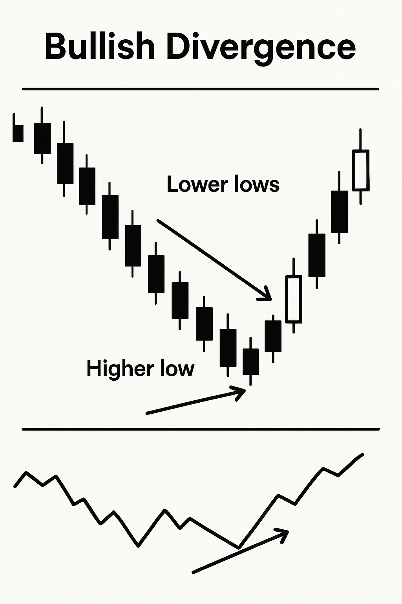
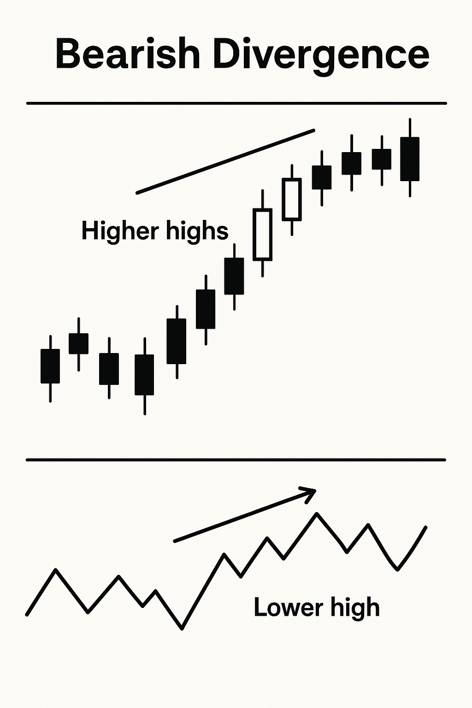

# 相对强弱指数 (RSI) 策略详解

## 1. RSI 是什么？

相对强弱指数 (Relative Strength Index, RSI) 由 Welles Wilder 于1978年提出，是一种动量震荡指标，用于衡量近期价格变动的速度和变化。RSI 的值介于0到100之间。

它的主要用途包括：
-   识别市场的**超买 (Overbought)** 和 **超卖 (Oversold)** 状态。
-   辅助判断趋势的强度。
-   发现潜在的趋势反转点（例如通过背离现象）。

## 2. RSI 的参数

-   **`period` (周期长度):** 这是 RSI 最主要的参数，对应计算公式中的 N。
    -   Welles Wilder 推荐的周期是 **14**。这仍然是最常用的设置，适用于日线图、周线图和月线图。
    -   较短的周期 (例如 7 或 9) 会使 RSI 更敏感，产生更多的交易信号，但假信号也可能更多。
    -   较长的周期 (例如 21 或 25) 会使 RSI 更平滑，产生的信号更少，但可能更可靠。
    交易者会根据交易的资产特性、时间周期和个人偏好来选择合适的 `period` 值。

-   **`overbought_threshold` 和 `oversold_threshold` (超买/超卖阈值):** 如前所述，常用的 `overbought_threshold` 为 70 和 `oversold_threshold` 为 30 可以根据实际情况调整为其他值，例如 80 和 20。

## 3. RSI 如何计算？

计算 RSI 通常涉及以下步骤，以一个常见的14周期 RSI 为例：

**a. 计算价格变化 (Change):**
   对于每个周期（通常是每日），计算收盘价相对于前一周期收盘价的变化量。
   `Change = 当期收盘价 - 前期收盘价`

**b. 分离上涨幅度和下跌幅度:**
   -   如果 `Change > 0`，则 `上涨幅度 (Gain) = Change`，`下跌幅度 (Loss) = 0`。
   -   如果 `Change < 0`，则 `上涨幅度 (Gain) = 0`，`下跌幅度 (Loss) = -Change` (取绝对值)。
   -   如果 `Change = 0`，则 `上涨幅度 (Gain) = 0`，`下跌幅度 (Loss) = 0`。

**c. 计算平均上涨幅度和平均下跌幅度:**
   这一步通常使用 Wilder 的平滑移动平均 (一种指数移动平均的变体)。设参数周期为 `period` (例如14)。
   -   **初始平均值 (前 `period` 个周期):**
      `初始平均上涨 = 前 period 个周期的上涨幅度之和 / period`
      `初始平均下跌 = 前 period 个周期的下跌幅度之和 / period`
   -   **后续平均值 (平滑):**
      `当期平均上涨 = (前期平均上涨 * (period-1) + 当期上涨幅度) / period`
      `当期平均下跌 = (前期平均下跌 * (period-1) + 当期下跌幅度) / period`

**d. 计算相对强度 (RS - Relative Strength):**
   `RS = 平均上涨幅度 / 平均下跌幅度`
   (如果平均下跌幅度为0，为避免除零错误，RS 通常被视为一个非常大的数，导致 RSI 趋近于100。)

**e. 计算 RSI:**
   `RSI = 100 - (100 / (1 + RS))`

   如果 RS 为0（即平均上涨为0），则 RSI 为0。

**公式总结:**
常用的 RSI 公式可以表示为：
`RSI = 100 - [100 / (1 + (平均上涨幅度 / 平均下跌幅度))]`

其中，平均上涨幅度和平均下跌幅度是经过特定周期 `period` 平滑处理的。

## 4. 如何解读 RSI？

-   **超买区域:** 通常认为当 RSI 值高于参数 `overbought_threshold` (例如默认70) 时，市场处于超买状态。这意味着资产价格可能上涨过快，短期内有回调的风险。
-   **超卖区域:** 通常认为当 RSI 值低于参数 `oversold_threshold` (例如默认30) 时，市场处于超卖状态。这意味着资产价格可能下跌过多，短期内有反弹的可能。
-   **中性区域 (例如30-70之间):** RSI 在这个区间内通常表示市场处于相对平衡或趋势持续状态。50通常被视为多空力量的平衡点。

**注意:** 超买/超卖的阈值 (例如 `overbought_threshold=70`, `oversold_threshold=30`) 是常用设定，但可以根据不同市场和资产特性进行调整 (例如，`overbought_threshold=80`, `oversold_threshold=20`)。

## 5. 基于 RSI 的基本交易信号

**a. 超买/超卖区域反转信号:**
   -   **买入信号:** 当 RSI 从超卖区域 (例如低于 `oversold_threshold`) 向上突破超卖线时，可能预示价格将反弹。
   -   **卖出信号:** 当 RSI 从超买区域 (例如高于 `overbought_threshold`) 向下跌破超买线时，可能预示价格将回调。

**b. RSI 中线交叉信号 (50 水平线):**
   -   **买入信号:** RSI 从下方上穿50中线，可能表示市场由弱转强。
   -   **卖出信号:** RSI 从上方下穿50中线，可能表示市场由强转弱。

**c. RSI 背离 (Divergence):**
   背离是 RSI 应用中一个重要的概念，通常预示着趋势可能反转。

   -   **看涨背离 (Bullish Divergence):** 
       当价格K线图形成一系列更低的低点（创出新低），而RSI指标的对应低点却未能创出新低，反而形成更高的低点时，即为看涨背离。这通常表明虽然价格在下跌，但下跌的动能正在减弱，市场可能即将反弹向上。

       

   -   **看跌背离 (Bearish Divergence):** 
       当价格K线图形成一系列更高的高点（创出新高），而RSI指标的对应高点却未能创出新高，反而形成更低的高点时，即为看跌背离。这通常表明虽然价格在上涨，但上涨的动能正在减弱，市场可能即将回调向下。

       

   *（注意：以上为背离示例图的占位符。实际应用中，您需要提供真实的图表图片（建议存放在 `docs/images/` 目录下并更新上述路径）。
     看涨背离示例图应清晰展示价格创新低点而RSI指标形成更高的对应低点的情况。
     看跌背离示例图应清晰展示价格创新高点而RSI指标形成更低的对应高点的情况。
     背离的识别需要仔细对比价格图表和RSI指标图表的对应高低点，图表示例将有助于直观理解。）*

## 6. RSI 的优点与局限性

**优点:**
-   简单易懂，计算相对直接。
-   能有效指示市场的超买超卖状态。
-   背离信号对于预测趋势反转有一定价值。
-   适用性广泛，可用于不同市场和时间周期。

**局限性:**
-   **震荡市更有效:** 在强劲的单边趋势市场中，RSI 可能会长时间停留在超买或超卖区域，过早给出反转信号，导致交易者错失主要趋势。例如，在强劲的牛市中，RSI 可能持续高于70，但价格继续上涨。
-   **假信号:** 像所有技术指标一样，RSI 也会产生假信号，尤其是在市场波动剧烈或周期选择不当的时候。
-   **滞后性:** RSI 是基于历史价格计算的，因此具有一定的滞后性。
-   **参数敏感性:** RSI 的表现对其参数（尤其是 `period`）较为敏感，不同的参数设定可能产生截然不同的交易信号。

**建议:**
RSI 通常不应单独使用，而是与其他技术指标、价格行为分析、趋势分析等方法结合使用，以提高交易决策的可靠性。例如，可以将 RSI 与移动平均线、支撑阻力位等结合起来进行综合判断。 